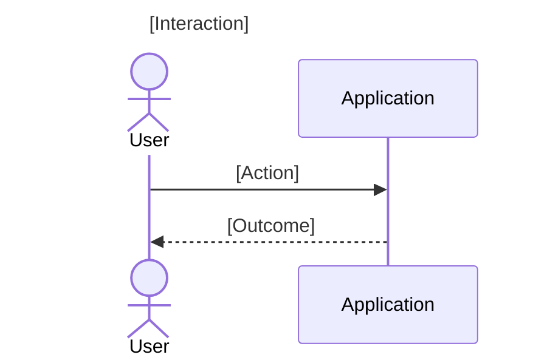

# Sequence diagram template

**Scope:** [interaction]
**Abstraction:** request/response sequence
**Last reviewed:** YYYY-MM-DD

```mermaid
sequenceDiagram
    title [Interaction]
    actor User
    participant App as Application
    User->>App: [Action]
    App-->>User: [Outcome]
```

[Explain the important behavior, error paths, and boundaries.]
